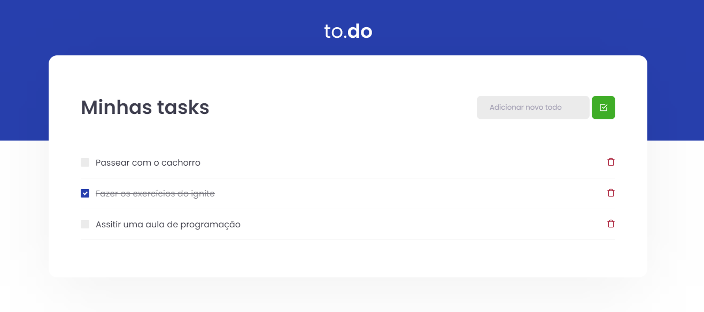

## 💻 Challenge to.do

## ✨ Technologies

- React
- Typescript
- Jest

## 👨‍💻 Project

"to.do" is a site for creating, marking and deleting tasks that need to be completed.

## 🎯 Challenge

The purpose of the activity was to create these functionalities:

- Add a new task;
- Delete a task;
- Mark and unmark a task as complete.
